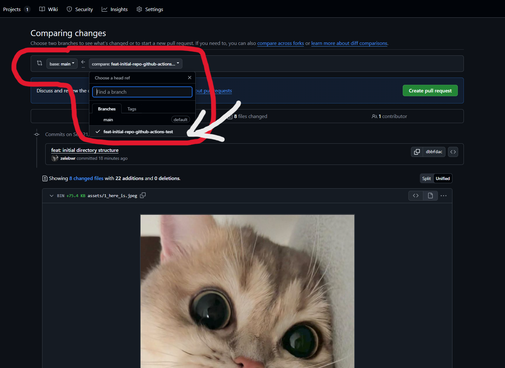

# 🚀 Contributing to This Project

This is a document for the guideline that you need to follow when wanting to contribute to this repo.

## ✨ The Golden Rule: All Work Happens Through Pull Requests

To ensure code quality and maintain a clean history, direct pushes to the `main` branch are disabled. **Every change, no matter how small, must be submitted through a Pull Request.**

## workflow-steps Our End-to-End Workflow

Our workflow is designed to be as automated and straightforward as possible. It **starts with an issue** and **ends with a merged pull request**.

### Step 1: Find or Create an Issue

All work begins with an issue. This helps us track tasks and bugs in one place.

1. **Navigate to the "Issues" or the "Projects" tab** in our repository.

    

    

    

2. **Search for an existing issue.** If you find one you want to work on, let the team know by commenting on it and then **create a new branch for it**

    

    

3. **Create a new issue** if one doesn't exist. Click "New issue" and choose the appropriate template.

4. **Write a clear title.** Use prefixes like `feat:`, `fix:`, or `docs:` as this will help us generate a good branch name later.

5. **Fill out the template.** Provide as much detail as possible.

### Step 2: Create a Branch from the Issue

Once you have an issue assigned to you, you can create a branch to start your work.

1. **Navigate to the issue page.**

2. On the right-hand sidebar, under "Development," click **"Create a branch"**.

    

3. GitHub will automatically suggest a branch name based on the issue title (e.g., `4-feat-add-contact-form`). You can accept this or make minor edits.

4. Once the branch is created, a command will be provided to check it out locally. Copy and run it in your terminal:

    ```sh
    git fetch origin
    git checkout <your-new-branch-name>
    ```

### Step 3: Develop and Commit Your Changes

Now you can start coding!

1. Make your changes to the codebase.

2. Commit your work with clear, descriptive messages.

    ```sh
    # Stage your changes
    git add .

    # Commit your changes
    git commit -m "feat: Add form validation to contact page"
    ```

### Step 4: Open a Pull Request (PR)

When your work is ready for review, it's time to open a pull request.

1. Push your branch to the repository:

    ```sh
    git push origin <your-branch-name>
    ```

2. Go to the repository on GitHub. A prompt will appear to "Compare & pull request." Click it.

3. **Our PR template will automatically fill the description.** Please take a moment to **fill out all the required sections**. This provides crucial context for your reviewers. A well-written PR gets reviewed faster!

    
    
    
    
    
    
    
    

4. Click "Create pull request."

**🤖 Automation Alert:** As soon as you open the PR:

-   The **PR author will be set as the assignee**.

-   **Two reviewers will be randomly assigned** from our team.

    

### Step 5: Code Review and Merging

Your assigned reviewers will look over your code.

1. **Monitor your PR.** Reviewers may ask for changes.

2. **Push updates if needed.** If you need to make changes, simply commit and push to the same branch. The pull request will update automatically.

3. **Approval and Merge.** Once your PR receives the required approvals, it will be merged into the `main` branch by a maintainer.

Congratulations, your contribution is now part of the project! Thank you! 🎉
